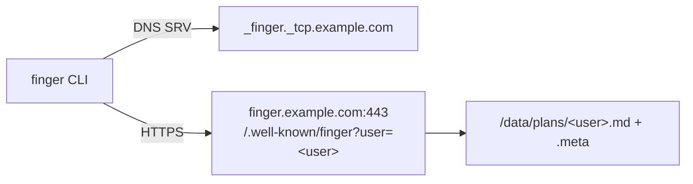

# finger

A modern revival of the [Finger protocol](https://datatracker.ietf.org/doc/html/rfc1288) — same CLI feel, HTTPS transport, SRV-based routing, and email-authenticated device keys.

```
$ finger jasper@example.com
jasper (example.com)
  Sitting on my porch. The frogs are loud tonight.
```

Share a short status. It replaces your previous one. Optionally auto-expires. No likes, no replies, no history. Just presence.

## Quick Start

### 1. Deploy the server (one per user)

```bash
docker run -d --name finger \
  -e FINGER_USER=jasper \
  -e FINGER_USER_EMAIL=jasper@example.com \
  -e FINGER_EMAIL_FROM=finger@example.com \
  -p 8000:8000 \
  ghcr.io/magnus919/finger:latest
```

### 2. Set up DNS

Add an SRV record so `finger user@example.com` finds your server:

```
_finger._tcp.example.com. 3600 IN SRV 0 1 443 finger.example.com.
```

If no SRV record exists, the client falls back to `https://example.com/.well-known/finger`.

### 3. Install the client

```bash
pip install finger
```

### 4. Authenticate

```bash
finger --init jasper@example.com
# Check your email for the auth code
finger --auth <code-from-email>
```

### 5. Set your status

```bash
finger --set "Working on something interesting"
finger --set "At lunch, back at 2" --ttl 1h
```

### 6. Read someone's status

```bash
finger jasper@example.com
```

## How It Works

**Read path:** `finger user@host` resolves `_finger._tcp.host` via DNS SRV, then `GET https://resolved-host/.well-known/finger?user=user`. No auth required.

**Write path:** `finger --set "status"` sends `PUT https://host/.well-known/finger/user/plan` with a `Bearer` token. The token is obtained via email magic link.

**TTL:** Optional auto-expiry. `--ttl 2h30m` stores a unix timestamp. On every read the server checks if the status has expired. Server startup also sweeps stale files.

**No system mode:** There is no `finger` without a user — no user enumeration, no "who's logged in." The only question this protocol answers is "what does this person want to share?"

## CLI Reference

```
finger user@host                    Read a status
finger --set "status"               Set your status (uses default host)
finger --set "status" --ttl 2h30m   Set with auto-expiry
finger --init user@host             Request auth token
finger --auth <token>               Complete auth with emailed token
finger --deauth user@host           Revoke all device keys
finger --status user@host           List active keys
finger --config --show              Show config
finger --config --key <key>         Manually set API key
finger --config --host <domain>     Set default host
finger --plain                      Read as plain text (no markdown)
finger --http                       Use HTTP instead of HTTPS (dev only)
finger --version                    Show version
```

## Protocol

- SRV record: `_finger._tcp`
- Fallback: `https://domain/.well-known/finger?user=<user>`
- All responses are `text/plain`
- Write operations require `Authorization: Bearer <device-key>`
- Read operations are public

See `docs/protocol.md` for the full specification.

## Architecture



## License

MIT
